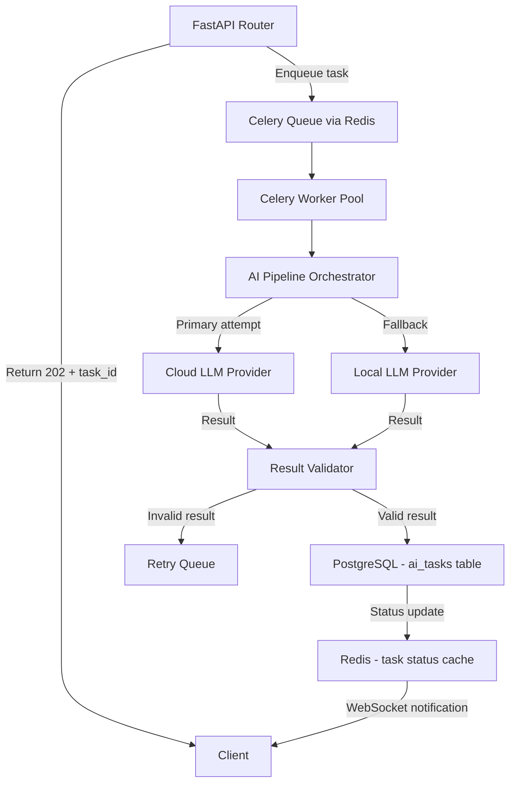

# 🧠 AI StudyFlow — Hybrid AI Inference Pipeline

> **Canonical Authority:** This document defines the complete architecture, operational rules,
> failure handling, and extension strategy for the AI inference pipeline. AI agents implementing
> any part of the AI subsystem MUST read this document before writing code.

---

## 1. PIPELINE OVERVIEW

### 1.1 Design Philosophy

The AI inference pipeline is a **volatile, isolated subsystem**. It sits completely outside the synchronous request/response path of the FastAPI application. This isolation is structural and non-negotiable for three reasons:

1. **Latency:** LLM inference takes 3–30 seconds. A synchronous handler would block the web server.
2. **Reliability:** Cloud LLM providers have SLA uptimes of ~99.9%, meaning ~8.7 hours of downtime per year. The application must continue functioning during those windows.
3. **Cost Control:** LLM calls are expensive. Async pipelines allow rate limiting, deduplication, and caching at the orchestration layer before any tokens are consumed.

### 1.2 System Context



---

## 2. DATABASE SCHEMA: AI TASKS

### 2.1 `ai_tasks` Table Definition

```sql
CREATE TABLE ai_tasks (
    id                UUID         PRIMARY KEY DEFAULT gen_random_uuid(),
    user_id           UUID         NOT NULL,
    task_type         VARCHAR(50)  NOT NULL CHECK (task_type IN (
                                      'FLASHCARD_GENERATION',
                                      'SESSION_SUMMARY',
                                      'QUIZ_GENERATION',
                                      'TOPIC_EXTRACTION'
                                  )),
    status            VARCHAR(20)  NOT NULL DEFAULT 'queued' CHECK (status IN (
                                      'queued', 'processing', 'completed', 'failed', 'cancelled'
                                  )),
    celery_task_id    VARCHAR(255) NULL,
    input_payload     JSONB        NOT NULL,
    output_payload    JSONB        NULL,
    error_message     TEXT         NULL,
    provider_used     VARCHAR(50)  NULL,
    prompt_tokens     INTEGER      NULL,
    completion_tokens INTEGER      NULL,
    attempt_count     INTEGER      NOT NULL DEFAULT 0,
    max_attempts      INTEGER      NOT NULL DEFAULT 3,
    created_at        TIMESTAMPTZ  NOT NULL DEFAULT NOW(),
    updated_at        TIMESTAMPTZ  NOT NULL DEFAULT NOW(),
    completed_at      TIMESTAMPTZ  NULL,
    deleted_at        TIMESTAMPTZ  NULL
);

CREATE INDEX idx_ai_tasks_user_id ON ai_tasks (user_id);
CREATE INDEX idx_ai_tasks_status ON ai_tasks (status) WHERE deleted_at IS NULL;
CREATE INDEX idx_ai_tasks_celery_id ON ai_tasks (celery_task_id) WHERE celery_task_id IS NOT NULL;
```

### 2.2 Status Transition Rules

```
queued → processing (worker picks up the task)
processing → completed (successful inference + validation)
processing → failed (all retries exhausted)
processing → queued (transient failure, re-queued for retry)
any → cancelled (user cancels, admin intervention)
```

**Prohibited transitions:** `completed → processing`, `failed → processing` without explicit `reset_task` operation.

---

## 3. CELERY TASK IMPLEMENTATION

### 3.1 Task Definition Rules

All AI Celery tasks MUST follow this template:

```python
from celery import Task
from app.infrastructure.celery import celery_app
from app.features.ai_pipeline.orchestrator import AIPipelineOrchestrator

class AIBaseTask(Task):
    """Base class enforcing idempotency and error recovery."""
    acks_late = True           # Re-queue if worker dies mid-execution
    reject_on_worker_lost = True
    max_retries = 3
    default_retry_delay = 30   # seconds

@celery_app.task(
    bind=True,
    base=AIBaseTask,
    name="ai_pipeline.generate_flashcards",
    queue="ai_inference",
    time_limit=120,            # Hard kill after 120 seconds
    soft_time_limit=90,        # Raises SoftTimeLimitExceeded at 90 seconds
)
async def generate_flashcards_task(self, task_id: str, user_id: str) -> None:
    """
    Idempotent flashcard generation task.
    
    All input data is loaded from the database using task_id.
    Parameters MUST NOT contain the input payload directly to prevent
    queue message size issues and enable idempotent retry behavior.
    """
    orchestrator = AIPipelineOrchestrator()
    try:
        await orchestrator.execute_flashcard_generation(task_id=task_id, user_id=user_id)
    except SoftTimeLimitExceeded:
        await orchestrator.mark_task_timeout(task_id)
        raise
    except Exception as exc:
        await orchestrator.mark_task_error(task_id, str(exc))
        raise self.retry(exc=exc)
```

### 3.2 Why `acks_late=True` Is Mandatory

By default, Celery acknowledges a task as soon as a worker receives it (`acks_early`). If the worker crashes during execution, the task is lost. With `acks_late=True`, the task is only acknowledged AFTER it completes successfully. If the worker crashes, the broker re-queues the task for another worker. Combined with idempotent task implementations (loading state from DB, not from parameters), this is safe.

### 3.3 Why Input Payload Must NOT Be in Task Parameters

Celery task parameters are serialized into the queue message. Large payloads (e.g., 10KB of study notes) in task parameters:
1. Bloat the Redis queue memory.
2. Cannot be inspected or modified after enqueuing.
3. Break idempotency because the same task ID with different parameters is ambiguous.

**Correct pattern:** Store the full input in the `ai_tasks.input_payload` JSONB column at enqueue time. The Celery task only receives `task_id` and loads its own input from the database.

---

## 4. AI PIPELINE ORCHESTRATOR

### 4.1 Orchestrator Architecture

The `AIPipelineOrchestrator` is the single class that coordinates the inference lifecycle. It MUST NOT be imported directly by FastAPI routers. It is only used inside Celery tasks.

```python
from abc import ABC, abstractmethod

class LLMProvider(ABC):
    """Interface that all LLM providers must implement."""
    
    @abstractmethod
    async def generate(
        self,
        prompt: str,
        system_prompt: str,
        max_tokens: int,
        temperature: float,
    ) -> LLMResponse:
        ...
    
    @abstractmethod
    async def health_check(self) -> bool:
        ...
    
    @property
    @abstractmethod
    def provider_name(self) -> str:
        ...


class LLMResponse(BaseModel):
    content: str
    prompt_tokens: int
    completion_tokens: int
    provider: str
    model: str
    finish_reason: str  # "stop", "length", "content_filter"


class AIPipelineOrchestrator:
    """
    Coordinates the multi-provider inference pipeline.
    
    Dependency Injection: providers are injected at construction time.
    The orchestrator has no knowledge of specific providers.
    """
    
    def __init__(
        self,
        primary_provider: LLMProvider,
        fallback_provider: LLMProvider | None,
        task_repo: AITaskRepository,
    ):
        self._primary = primary_provider
        self._fallback = fallback_provider
        self._task_repo = task_repo
    
    async def execute_flashcard_generation(self, task_id: str, user_id: str) -> None:
        task = await self._task_repo.get_by_id(task_id, user_id=user_id)
        await self._task_repo.mark_processing(task_id)
        
        raw_content = task.input_payload["source_content"]
        card_count = task.input_payload["card_count"]
        
        # Enforce context window limit before inference
        truncated_content = self._truncate_to_context_window(raw_content, max_chars=12000)
        
        prompt = self._build_flashcard_prompt(truncated_content, card_count)
        response = await self._invoke_with_fallback(prompt)
        validated = self._validate_flashcard_output(response.content)
        
        await self._task_repo.mark_completed(task_id, output=validated.model_dump())
```

### 4.2 Provider Selection and Fallback Logic

```python
async def _invoke_with_fallback(self, prompt: str) -> LLMResponse:
    """
    Attempt primary provider. Fall back to secondary on failure.
    Never raises — either returns a response or marks task as failed.
    """
    primary_healthy = await self._primary.health_check()
    
    if primary_healthy:
        try:
            return await asyncio.wait_for(
                self._primary.generate(prompt),
                timeout=60.0
            )
        except (asyncio.TimeoutError, LLMProviderError) as e:
            logger.warning(
                "primary_provider_failed",
                provider=self._primary.provider_name,
                error=str(e)
            )
    
    if self._fallback:
        logger.info("falling_back_to_secondary_provider", 
                    provider=self._fallback.provider_name)
        return await self._fallback.generate(prompt)
    
    raise AllProvidersFailedError("No available LLM providers")
```

---

## 5. CONTEXT WINDOW MANAGEMENT

### 5.1 The Context Window Overflow Problem

Study notes submitted by users can be arbitrarily large. Sending 100,000 tokens of text to an LLM when the context window is 8,192 tokens will cause the API call to fail with a `context_length_exceeded` error. This is an entirely foreseeable failure that MUST be handled proactively.

### 5.2 Mandatory Truncation Strategy

Before any content is passed to an LLM, it MUST pass through the content preparation pipeline:

```python
def _truncate_to_context_window(
    self,
    content: str,
    max_chars: int = 12000,  # Conservative limit; actual token count varies
    strategy: str = "semantic"  # "semantic" | "tail" | "head"
) -> str:
    """
    Truncates content to fit within safe LLM context limits.
    
    Strategy "semantic": Attempt to chunk by sentence/paragraph boundaries
    to preserve coherent units of meaning.
    
    Strategy "tail": Truncate from the end (keep first N chars).
    Used as fallback if semantic chunking fails.
    
    The max_chars value is deliberately conservative to account for
    the prompt template overhead and tokenizer variance between providers.
    """
    if len(content) <= max_chars:
        return content
    
    if strategy == "semantic":
        return self._semantic_truncate(content, max_chars)
    
    return content[:max_chars]
```

### 5.3 Multi-Chunk Processing for Long Documents

When content cannot be meaningfully truncated (e.g., a full textbook chapter), the pipeline MUST split it into overlapping chunks and generate flashcards for each chunk:

```
content (50,000 chars)
→ chunk_1 (0–12,000 chars, with 500-char overlap)
→ chunk_2 (11,500–23,500 chars, with 500-char overlap)
→ chunk_3 (23,000–35,000 chars, with 500-char overlap)
→ generate_flashcards(chunk_1) → 4 cards
→ generate_flashcards(chunk_2) → 3 cards
→ generate_flashcards(chunk_3) → 3 cards
→ deduplicate_cards([...10 cards])
→ persist 10 unique cards
```

This strategy MUST be implemented as multiple sub-tasks, each tracked independently.

---

## 6. OUTPUT VALIDATION

### 6.1 Why LLM Output Validation Is Non-Optional

LLMs produce non-deterministic text. Even with structured output prompting and JSON mode, they can:
- Produce malformed JSON.
- Produce JSON with missing required fields.
- Produce semantically valid JSON with values that violate business constraints (e.g., 500 flashcards when 10 were requested).
- Produce content that triggers content safety filters.

Every LLM response MUST be validated before being persisted.

### 6.2 Output Schema Definitions

```python
class FlashcardItem(BaseModel):
    front: str = Field(..., min_length=5, max_length=500)
    back: str = Field(..., min_length=5, max_length=2000)
    difficulty: Literal["easy", "medium", "hard"] = "medium"
    tags: list[str] = Field(default_factory=list, max_items=5)

class FlashcardGenerationOutput(BaseModel):
    cards: list[FlashcardItem] = Field(..., min_items=1, max_items=50)
    source_language: str = Field(..., pattern="^[a-z]{2}$")
    generation_model: str

def _validate_flashcard_output(self, raw_output: str) -> FlashcardGenerationOutput:
    try:
        data = json.loads(raw_output)
        return FlashcardGenerationOutput.model_validate(data)
    except json.JSONDecodeError as e:
        logger.error("llm_json_parse_failed", raw_length=len(raw_output))
        raise AIOutputValidationError("LLM returned non-JSON response") from e
    except ValidationError as e:
        logger.error("llm_schema_validation_failed", errors=e.errors())
        raise AIOutputValidationError("LLM response failed schema validation") from e
```

---

## 7. PROVIDER IMPLEMENTATIONS

### 7.1 Provider Interface Contract

All providers MUST implement `LLMProvider`. No provider-specific code leaks outside the provider's own file.

### 7.2 OpenAI Provider

```python
class OpenAIProvider(LLMProvider):
    """Primary inference provider. Requires OPENAI_API_KEY setting."""
    
    def __init__(self, api_key: str, model: str = "gpt-4o-mini"):
        self._client = AsyncOpenAI(api_key=api_key)
        self._model = model
    
    async def generate(self, prompt: str, ...) -> LLMResponse:
        response = await self._client.chat.completions.create(
            model=self._model,
            messages=[
                {"role": "system", "content": system_prompt},
                {"role": "user", "content": prompt}
            ],
            response_format={"type": "json_object"},
            max_tokens=max_tokens,
            temperature=temperature,
        )
        return LLMResponse(
            content=response.choices[0].message.content,
            prompt_tokens=response.usage.prompt_tokens,
            completion_tokens=response.usage.completion_tokens,
            provider="openai",
            model=self._model,
            finish_reason=response.choices[0].finish_reason,
        )
    
    async def health_check(self) -> bool:
        try:
            await asyncio.wait_for(
                self._client.models.list(),
                timeout=5.0
            )
            return True
        except Exception:
            return False
    
    @property
    def provider_name(self) -> str:
        return "openai"
```

### 7.3 Local LLM Provider (Ollama)

```python
class LocalOllamaProvider(LLMProvider):
    """
    Fallback provider using locally hosted Ollama.
    Used when cloud LLM is unavailable or for cost reduction.
    
    Requires OLLAMA_HOST setting (default: http://localhost:11434).
    """
    
    def __init__(self, host: str, model: str = "llama3:8b"):
        self._host = host
        self._model = model
    
    async def generate(self, prompt: str, ...) -> LLMResponse:
        async with aiohttp.ClientSession() as session:
            async with session.post(
                f"{self._host}/api/chat",
                json={
                    "model": self._model,
                    "messages": [{"role": "user", "content": prompt}],
                    "format": "json",
                    "stream": False,
                }
            ) as resp:
                data = await resp.json()
                return LLMResponse(
                    content=data["message"]["content"],
                    prompt_tokens=data["prompt_eval_count"],
                    completion_tokens=data["eval_count"],
                    provider="ollama",
                    model=self._model,
                    finish_reason="stop",
                )
    
    @property
    def provider_name(self) -> str:
        return "ollama"
```

---

## 8. FAILURE SCENARIOS & RECOVERY

### 8.1 Scenario: Cloud LLM Rate Limit (429)

**Detection:** `openai.RateLimitError` is raised.

**Recovery:**
1. Log warning with `provider=openai, error=rate_limit`.
2. Fall back to Local Ollama provider immediately.
3. If Ollama is also unavailable, mark task status as `queued` in the DB.
4. Use Celery's exponential backoff retry: 30s, 60s, 120s.
5. After 3 failed retries, mark task as `failed` with `error_message="All providers exhausted"`.

### 8.2 Scenario: LLM Returns Malformed JSON

**Detection:** `json.JSONDecodeError` in output validation.

**Recovery:**
1. Log error with `raw_output_snippet` (first 500 chars only — avoid logging full PII).
2. Retry the exact same prompt once with `temperature=0` (lower temperature → more structured output).
3. If second attempt also fails, mark task as `failed`.
4. **Do NOT** retry with a different prompt. Prompt changes must be deliberate, versioned changes, not automatic recovery behavior.

### 8.3 Scenario: Celery Worker OOM Kill

**Detection:** Worker process killed by OS. Task disappears from processing queue.

**Recovery:**
Because `acks_late=True` and `reject_on_worker_lost=True`, the broker re-queues the task automatically. The task will be picked up by another worker. Because the task loads its state from the DB using `task_id`, there is no risk of duplicate processing — the task begins fresh from `status=queued`.

### 8.4 Scenario: Context Window Overflow Not Detected

**Detection:** `openai.BadRequestError` with `code=context_length_exceeded`.

**Recovery:**
1. Log error with `content_length`, `estimated_tokens`.
2. Halve the `max_chars` parameter and re-invoke the truncation pipeline.
3. Retry with truncated content.
4. If still failing, mark task as `failed` with guidance to the user to provide shorter content.

---

## 9. PROMPT ENGINEERING GOVERNANCE

### 9.1 Prompts Are Versioned Artifacts

Prompts are not strings hardcoded in service files. They are versioned templates stored in `app/features/ai_pipeline/prompts/`:

```
app/features/ai_pipeline/prompts/
├── flashcard_generation/
│   ├── v1.py     ← initial version
│   ├── v2.py     ← improved version with structured output
│   └── current.py  ← symlink or import pointing to active version
├── session_summary/
│   └── v1.py
└── quiz_generation/
    └── v1.py
```

### 9.2 Prompt Change Protocol

Changing a prompt is a **functional change** that affects the quality and structure of all future AI-generated content. Prompt changes MUST:
1. Be implemented as a new version file (`v2.py`), not a modification of the existing file.
2. Be A/B tested on a small percentage of tasks before full rollout.
3. Validated against the output schema with sample inputs before deployment.

---

## 10. COST MONITORING & TOKEN TRACKING

### 10.1 Token Usage Must Be Recorded

Every successful LLM call MUST record token usage in the `ai_tasks` table:

```python
await self._task_repo.update_token_usage(
    task_id=task_id,
    prompt_tokens=response.prompt_tokens,
    completion_tokens=response.completion_tokens,
    provider_used=response.provider,
)
```

### 10.2 User Quota Enforcement

Free-tier users MUST be subject to token consumption limits enforced at the service layer BEFORE the task is enqueued:

```python
async def validate_user_quota(self, user_id: UUID, estimated_tokens: int) -> None:
    monthly_usage = await self._task_repo.get_monthly_token_usage(user_id)
    if monthly_usage + estimated_tokens > settings.FREE_TIER_MONTHLY_TOKEN_LIMIT:
        raise QuotaExceededError(
            f"Monthly AI generation limit reached. "
            f"Used: {monthly_usage}, Limit: {settings.FREE_TIER_MONTHLY_TOKEN_LIMIT}"
        )
```

---

## 11. AI PIPELINE EXTENSIBILITY STRATEGY

### 11.1 Adding a New Task Type

To add a new AI generation task type (e.g., `TOPIC_EXTRACTION`):

1. Add `'TOPIC_EXTRACTION'` to the `ai_tasks.task_type` CHECK constraint migration.
2. Create a prompt template in `prompts/topic_extraction/v1.py`.
3. Define the output Pydantic schema (`TopicExtractionOutput`).
4. Add `execute_topic_extraction()` method to `AIPipelineOrchestrator`.
5. Register a new Celery task `extract_topics_task` following the base task template.
6. Add the enqueue logic to the relevant FastAPI router.
7. Update this document with the new task type.

### 11.2 Adding a New LLM Provider

To add a new provider (e.g., Anthropic Claude):

1. Create `app/features/ai_pipeline/providers/anthropic_provider.py`.
2. Implement `LLMProvider` interface — all required methods.
3. Register the provider in the Celery worker's DI container.
4. Add provider config to Pydantic Settings (`ANTHROPIC_API_KEY`).
5. Configure it as primary or fallback in the orchestrator factory.
6. **No other files need to change.** This is the benefit of the interface-first architecture.

---

*End of AI Pipeline Architecture — Last reviewed: 2026-05-07*
