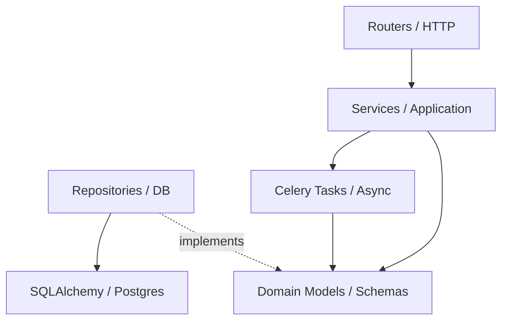
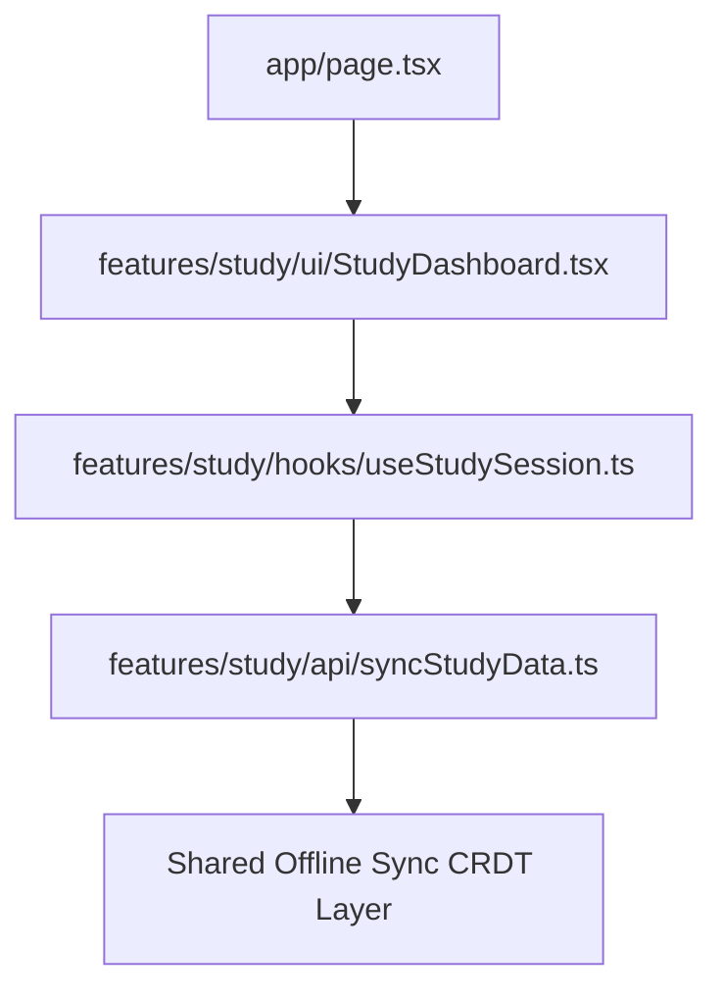

# Architecture Dependency Governance & Boundary Rules

**TARGET FILE:** `.ai/architecture/dependencies.md`

---

## 1. Introduction & AI-Context Strategy

### 1.1 Purpose of Dependency Governance
In a multi-year AI-assisted engineering system, **dependency management is AI context management**. If the architecture allows spaghetti dependencies, an AI agent attempting to modify one feature will inevitably break an undocumented dependency in another feature. This document establishes immutable laws for dependency flow, import structures, and boundary isolation.

### 1.2 The Token-Efficient Modularization Strategy
AI agents have limited context windows and degrading attention spans. By enforcing strict module boundaries and explicit dependency graphs:
- AI agents do not need to load entire features to understand how to interact with them.
- Context windows are reserved for the exact vertical slice being modified.
- AI hallucinated imports are eliminated through predictable architectural constraints.
- Architecture drift is structurally prevented.

---

## 2. Core Dependency Principles

### 2.1 Uni-Directional Dependency Flow
Dependencies must only flow in one direction: **Inward toward the Domain**.
- **Domain Layer** depends on nothing. It contains pure business logic, Pydantic models, and TypeScript interfaces.
- **Application Layer** depends on the Domain Layer. It orchestrates use cases.
- **Infrastructure Layer** depends on the Domain Layer (via dependency inversion). It implements external contracts (DB, Redis, API clients).
- **Presentation Layer (Routers/UI)** depends on the Application Layer.

### 2.2 Dependency Inversion Strategy
High-level modules must not depend on low-level modules. Both must depend on abstractions.
**HOW AI Agents should reason about this:**
If Feature A needs to save data, it MUST NOT import the PostgreSQL repository directly. It must define an interface (e.g., `StudySessionRepository`) in its Domain layer. The Infrastructure layer implements this interface. The Application layer receives the implementation via Dependency Injection.
**WHY:** This isolates the AI agent writing the business logic from the AI agent writing the SQL queries, preventing context contamination.

### 2.3 The "One-Entrypoint" Rule
Features must expose exactly one entrypoint (`index.ts` for frontend, `__init__.py` for backend). 
All cross-feature interactions MUST occur through this entrypoint. Internal imports across feature boundaries are **STRICTLY FORBIDDEN**.

---

## 3. The Vertical Slice Architecture

AI StudyFlow uses a Modular Monolith architecture based on Vertical Slices. Each slice is an isolated feature domain.

### 3.1 Feature Isolation Boundaries
```text
src/
└── features/
    ├── user_auth/
    ├── study_sessions/
    └── flashcard_engine/
```
Each feature is a mini-application. A change in `user_auth` must have a **zero percent chance** of breaking `flashcard_engine`.

### 3.2 Cross-Feature Communication Rules
If `study_sessions` needs user data from `user_auth`, it CANNOT query the `user_auth` database tables directly.
**Allowed Methods:**
1. **Function Call via Entrypoint:** `study_sessions` calls `get_user_summary(user_id)` exposed in `features/user_auth/__init__.py`.
2. **Event-Driven (PubSub/Celery):** `user_auth` emits a `USER_DELETED` event. `study_sessions` listens and reacts.

### 3.3 Anti-Coupling Enforcement
AI agents MUST NOT create foreign keys across feature boundaries at the database level unless explicitly authorized. Instead, store the ID as a logical reference (e.g., `user_id: UUID`) and manage referential integrity via application logic.
**WHY:** Cross-feature foreign keys cause cascading deletes that AI agents fail to anticipate, leading to catastrophic data loss.

---

## 4. Backend Dependency Flow (FastAPI / Python)

### 4.1 Layer Diagram



### 4.2 Allowed vs Forbidden Imports

**ALLOWED:**
```python
# Importing from own domain
from .domain.models import StudySession

# Importing public contract of another feature
from features.users import get_user_tier
```

**FORBIDDEN (Will cause immediate rejection):**
```python
# DO NOT import internal infrastructure of another feature
from features.users.infrastructure.database import UserTable 

# DO NOT import internal services of another feature
from features.users.application.services import _calculate_user_score
```

### 4.3 Async Boundary Rules
- HTTP Routers must be `async`.
- Database calls must use `async` sessions (AsyncIO SQLAlchemy).
- Heavy computations (LLM generation) MUST be offloaded to Celery. The dependency flow here is: `Router -> Celery Enqueue -> return 202 Accepted`.
- **Constraint:** Celery tasks must not depend on HTTP request contexts. They must be self-contained.

### 4.4 Infrastructure Boundary Rules
External APIs (e.g., OpenAI, Stripe) must be wrapped in an Infrastructure Adapter.
**WHY:** If OpenAI changes its SDK, the AI agent only needs to modify the adapter, not the 50 files that use the LLM.

---

## 5. Frontend Dependency Flow (Next.js / TypeScript)

### 5.1 App Router Isolation
Next.js App Router (`app/`) is strictly for routing and layout. It **MUST NOT** contain business logic or complex state.



### 5.2 Component Isolation Rules
- **UI Components** (`ui/`) must be pure. They receive props and emit events. They cannot depend on data fetching hooks.
- **Container Components** depend on Hooks.
- **Hooks** depend on API/Sync functions.

### 5.3 Offline Sync Dependency Isolation
Features must write data to the local IndexedDB wrapper. Features **MUST NOT** depend directly on `fetch()` to external servers for mutations.
**WHY:** This enforces the offline-first requirement. The Sync Engine runs as a background process and depends on the local database, completely decoupled from the UI.

---

## 6. Event-Driven Communication Boundaries

### 6.1 Decoupling via Events
To prevent strong coupling, features should communicate via events when synchronous responses are not required.

### 6.2 Redis PubSub & Celery Signals
- Use **Redis PubSub** for ephemeral events (e.g., notifying the frontend via WebSocket that an AI generation task finished).
- Use **Celery Signals** for durable background workflows (e.g., sending an email after a study session completes).

**Rule:** Event producers MUST NOT depend on event consumers. The producer emits the event and forgets it.

---

## 7. Shared Kernel & Utility Governance

### 7.1 What belongs in `shared/`?
The `shared/` directory is a high-risk area for coupling. Only highly generic, domain-agnostic code belongs here.
**Allowed:**
- Date parsing utilities.
- Core UI components (Buttons, Inputs).
- Custom error classes.
- Logging wrappers.

### 7.2 Strict Prohibition on Domain Logic in Shared
**DO NOT** place domain-specific logic in `shared/`.
**Example of a violation:** Putting a `calculate_study_score()` function in `shared/utils.ts`. 
**Why:** It drags study domain knowledge into the shared kernel, forcing every feature that imports `shared` to indirectly depend on the study domain.

---

## 8. AI Inference Pipeline Isolation

### 8.1 Strict Boundary Separation
The Hybrid AI Inference pipeline is a volatile subsystem. Models change, prompt engineering evolves, and providers fail.
- **Rule:** The web application (FastAPI) MUST NOT depend directly on LLM SDKs (e.g., `import openai`).
- **Dependency Flow:** FastAPI -> Database Queue -> Celery Worker -> AI Adapter -> LLM Provider.

### 8.2 Fallback Strategy Boundaries
The pipeline must define distinct boundaries for primary and fallback inference.
- The `AIPipelineOrchestrator` depends on an abstract `LLMProvider` interface.
- Implementations (`OpenAIProvider`, `LocalLlamaProvider`) depend on the interface.
- If OpenAI times out, the Orchestrator safely swaps to the Local provider without affecting the core application logic.

---

## 9. Circular Dependency Prevention

### 9.1 The Cause of Circular Imports
Circular dependencies occur when Feature A depends on Feature B, and Feature B depends on Feature A. In an AI-Context Architecture, this causes absolute context failure, as the AI agent gets stuck in infinite loops trying to resolve types.

### 9.2 How to Resolve and Prevent
1. **Extract to Shared Interface:** If A and B need to know about a shared concept, extract the interface to a neutral domain model.
2. **Use Dependency Injection:** Pass the dependency at runtime rather than import time.
3. **Use Event-Driven Architectures:** Have A emit an event that B listens to, breaking the direct import chain.

**Python Rule:** Under no circumstances should `TYPE_CHECKING` be heavily relied upon to solve deep architectural circular dependencies. Fix the architecture instead.

---

## 10. Testing Dependency Boundaries

### 10.1 Test Isolation
Unit tests MUST test exactly one Vertical Slice.
- Tests in `features/user_auth/` MUST NOT require the database schema for `features/flashcard_engine/` to be instantiated.
- **Mocking Boundaries:** Mock at the Infrastructure layer boundary, NEVER at the internal Application layer boundary.
**WHY:** Mocking internal functions makes tests brittle and resistant to safe refactoring by AI agents.

---

## 11. Refactor Safety & Future Scalability

### 11.1 Safe Refactor Dependency Mapping
When an AI agent needs to refactor a dependency:
1. Create the new module (`DependencyV2`).
2. Implement the existing interface.
3. Update the Dependency Injection container to point to `DependencyV2`.
4. Delete `DependencyV1` in a separate, isolated PR.

### 11.2 Plugin/Extensibility Strategy
For future scalability, core systems (like offline sync resolution) must follow the Open/Closed Principle. They should be open for extension (e.g., adding a new conflict resolution strategy) but closed for modification. This is achieved by having the core system depend on a registry of strategy interfaces.

---

## 12. Anti-Patterns & Strict Import Rules

### 12.1 The AI Context Dilution Anti-Pattern
**Scenario:** An AI agent needs to update the color of a button. Because the Button component deeply imports user state, authentication logic, and offline sync hooks (a violation of component isolation), the AI agent must load 5,000 tokens of backend logic to change a CSS class.
**Result:** Token limit breached, context lost, hallucinated code introduced.
**Fix:** Strict dependency isolation ensures the Button only depends on React and CSS.

### 12.2 Strict DO / DO NOT Dependency Matrix

| Action | DO | DO NOT | Consequence of Violation |
|---|---|---|---|
| **Cross-Feature Imports** | Import from the feature's root `index.ts` or `__init__.py`. | Import deeply from `features/xyz/internal/file.ts`. | Silent breakages when the internal file is renamed or refactored. |
| **Database Access** | Go through the local feature's Repository. | Query another feature's tables directly using SQL. | Schema lock-in, impossible to shard databases in the future. |
| **Shared Utilities** | Create domain-agnostic helpers. | Place business logic in `shared/`. | Shared folder becomes a monolithic dumping ground, destroying token efficiency. |
| **API Clients** | Define an Interface in Domain, implement in Infrastructure. | Scatter `requests.get()` or `fetch()` throughout Application code. | Impossible to mock for tests, impossible to switch providers safely. |
| **Frontend State** | Isolate state locally to the feature slice. | Use global Redux stores for ephemeral component state. | Forces AI agents to load the entire global store to understand a single dropdown menu. |

---

### End of Document
*This document acts as an immutable law for AI-assisted operations in the AI StudyFlow codebase. All agents must validate their dependency trees against this framework prior to executing file modifications.*
