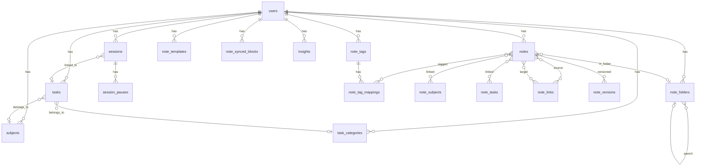

# 📊 AI StudyFlow — Database Schema

> **Engine:** PostgreSQL 15 (Docker)  
> **Migrations:** Alembic (20 migration files)  
> **Last updated:** 2026-06-27

---

## 1. Tổng quan (Overview)

AI StudyFlow sử dụng **PostgreSQL 15** chạy qua Docker container, quản lý migration bằng **Alembic**.

| Metric | Value |
|--------|-------|
| Database engine | PostgreSQL 15 |
| Total tables | 17+ |
| Feature modules | 7 (Auth, Sessions, Tasks, Subjects, Notes, Insights, Templates) |
| Migration files | 20 (`alembic/versions/`) |

### Conventions

| Convention | Detail |
|------------|--------|
| Primary keys | `UUID` with server-side default (`gen_random_uuid()`) |
| Naming | `snake_case` for all tables and columns |
| Timestamps | `TIMESTAMPTZ` (timezone-aware) |
| Soft delete | `deleted_at` column (nullable `TIMESTAMPTZ`) |
| JSON storage | `JSONB` type with GIN index where applicable |
| FK on ownership | `CASCADE` delete for user-owned resources |
| FK on optional refs | `SET NULL` for optional cross-references |

---

## 2. ER Diagram



---

## 3. Table Definitions

### 3.1 `users`

> **Module:** Auth · **Central entity** — all other tables reference `users.id`.

| Column | Type | Constraints | Default |
|--------|------|-------------|---------|
| `id` | `UUID` | **PK** | `gen_random_uuid()` |
| `email` | `VARCHAR(255)` | `UNIQUE`, `NOT NULL`, indexed | — |
| `hashed_password` | `VARCHAR(255)` | `NOT NULL` | — |
| `display_name` | `VARCHAR(100)` | — | — |
| `soul_color_hex` | `VARCHAR(7)` | — | `'#e2e8f0'` |
| `lite_mode_enabled` | `BOOLEAN` | — | `false` |
| `timezone` | `VARCHAR(50)` | — | — |
| `subscription_tier` | `VARCHAR(50)` | — | `'free'` |
| `llm_provider` | `VARCHAR(50)` | — | `'OLLAMA'` |
| `llm_api_key` | `VARCHAR(255)` | nullable | — |
| `created_at` | `TIMESTAMPTZ` | — | `NOW()` |
| `updated_at` | `TIMESTAMPTZ` | — | `NOW()` |

**Indexes:**
- `ix_users_email` — unique index on `email`

**Notes:**
- `soul_color_hex` — user's personalized UI accent color
- `llm_api_key` — encrypted at application layer; nullable for free-tier users using local Ollama

---

### 3.2 `sessions`

> **Module:** Focus Sessions · Tracks Pomodoro/flow study sessions.

| Column | Type | Constraints | Default |
|--------|------|-------------|---------|
| `id` | `UUID` | **PK** | `gen_random_uuid()` |
| `user_id` | `UUID` | **FK** → `users.id` `CASCADE` | — |
| `task_id` | `UUID` | **FK** → `tasks.id` `SET NULL`, nullable | — |
| `title` | `VARCHAR(255)` | — | — |
| `notes` | `VARCHAR(5000)` | nullable | — |
| `topic_ids` | `UUID[]` | nullable | — |
| `status` | `VARCHAR(50)` | — | `'PENDING'` |
| `duration_seconds` | `INTEGER` | — | `0` |
| `last_seen_at` | `TIMESTAMPTZ` | — | — |
| `created_at` | `TIMESTAMPTZ` | — | — |
| `updated_at` | `TIMESTAMPTZ` | — | — |
| `deleted_at` | `TIMESTAMPTZ` | nullable | — |

**Status enum values:**

| Value | Description |
|-------|-------------|
| `PENDING` | Session created but timer not started |
| `ACTIVE` | Timer running |
| `PAUSED` | Timer paused (pause recorded in `session_pauses`) |
| `COMPLETED` | Session ended normally |
| `INTERRUPTED` | Session ended prematurely |

**Foreign keys:**
- `user_id` → `users.id` `ON DELETE CASCADE`
- `task_id` → `tasks.id` `ON DELETE SET NULL`

**Notes:**
- `topic_ids` stores an array of subject UUIDs for multi-topic sessions
- Soft-deletable via `deleted_at`

---

### 3.3 `session_pauses`

> **Module:** Focus Sessions · Records individual pause intervals within a session.

| Column | Type | Constraints | Default |
|--------|------|-------------|---------|
| `id` | `UUID` | **PK** | `gen_random_uuid()` |
| `session_id` | `UUID` | **FK** → `sessions.id` `CASCADE` | — |
| `pause_duration_seconds` | `INTEGER` | — | `0` |
| `created_at` | `TIMESTAMPTZ` | — | *(paused_at)* |
| `updated_at` | `TIMESTAMPTZ` | — | *(resumed_at)* |
| `deleted_at` | `TIMESTAMPTZ` | nullable | — |

**Foreign keys:**
- `session_id` → `sessions.id` `ON DELETE CASCADE`

**Notes:**
- `created_at` represents the moment the session was paused
- `updated_at` represents the moment the session was resumed
- `pause_duration_seconds` is calculated as `updated_at - created_at`

---

### 3.4 `subjects`

> **Module:** Subjects · Academic subjects or study topics.

| Column | Type | Constraints | Default |
|--------|------|-------------|---------|
| `id` | `UUID` | **PK** | `uuid4()` |
| `user_id` | `UUID` | **FK** → `users.id` `CASCADE` | — |
| `title` | `VARCHAR(100)` | `NOT NULL` | — |
| `description` | `TEXT` | nullable | — |
| `priority` | `ENUM` | `LOW` / `MEDIUM` / `HIGH` | — |
| `color` | `VARCHAR(7)` | `CHECK` hex pattern, nullable | — |
| `created_at` | `TIMESTAMPTZ` | — | — |
| `updated_at` | `TIMESTAMPTZ` | — | — |

**Foreign keys:**
- `user_id` → `users.id` `ON DELETE CASCADE`

**Notes:**
- `color` must match hex pattern `#RRGGBB` (enforced via `CHECK` constraint)
- Referenced by `tasks.subject_id` and `note_subjects.subject_id`

---

### 3.5 `task_categories`

> **Module:** Tasks · User-defined task categories with color coding.

| Column | Type | Constraints | Default |
|--------|------|-------------|---------|
| `id` | `UUID` | **PK** | — |
| `user_id` | `UUID` | **FK** → `users.id` | — |
| `name` | `VARCHAR(50)` | — | — |
| `color_code` | `VARCHAR(7)` | `CHECK` hex | — |
| `created_at` | `TIMESTAMPTZ` | — | — |
| `updated_at` | `TIMESTAMPTZ` | — | — |

**Foreign keys:**
- `user_id` → `users.id`

---

### 3.6 `tasks`

> **Module:** Tasks · Study tasks with scheduling, recurrence, and status tracking.

| Column | Type | Constraints | Default |
|--------|------|-------------|---------|
| `id` | `UUID` | **PK** | `uuid4()` |
| `user_id` | `UUID` | **FK** → `users.id` `CASCADE` | — |
| `title` | `VARCHAR(100)` | `NOT NULL` | — |
| `description` | `TEXT` | nullable | — |
| `category_id` | `UUID` | **FK** → `task_categories.id`, nullable | — |
| `subject_id` | `UUID` | **FK** → `subjects.id`, nullable | — |
| `subtasks` | `JSONB` | nullable | — |
| `recurrence_rule` | `VARCHAR(255)` | nullable | — |
| `overtime_buffer_minutes` | `INTEGER` | nullable | — |
| `failed_reason` | `TEXT` | nullable | — |
| `task_status` | `VARCHAR(20)` | — | `'PENDING'` |
| `linked_note_id` | `UUID` | nullable | — |
| `color_code` | `VARCHAR(7)` | nullable | — |
| `planned_start` | `TIMESTAMPTZ` | `NOT NULL` | — |
| `planned_end` | `TIMESTAMPTZ` | `CHECK > planned_start` | — |
| `priority` | `INTEGER` | `CHECK 1-3` | — |
| `status` | `VARCHAR(20)` | — | `'PENDING'` |
| `completion_status` | `VARCHAR(50)` | — | `'INCOMPLETE'` |
| `is_deleted` | `BOOLEAN` | — | `false` |
| `created_at` | `TIMESTAMPTZ` | — | — |
| `updated_at` | `TIMESTAMPTZ` | — | — |

**`task_status` enum values:**

| Value | Description |
|-------|-------------|
| `PENDING` | Task not yet started |
| `IN_PROGRESS` | Task is being worked on |
| `USING_OVERTIME` | Past `planned_end`, within overtime buffer |
| `FAILED` | Task failed (reason in `failed_reason`) |
| `COMPLETED` | Task finished successfully |

**Foreign keys:**
- `user_id` → `users.id` `ON DELETE CASCADE`
- `category_id` → `task_categories.id`
- `subject_id` → `subjects.id`

**Indexes:**
- `ix_tasks_user_id` — on `user_id` for user-specific queries
- `ix_tasks_subject_id` — on `subject_id` for subject-specific queries

**Notes:**
- `subtasks` stores a JSONB array of sub-task objects (`{ title, completed }`)
- `recurrence_rule` follows iCal `RRULE` format (e.g., `FREQ=DAILY;INTERVAL=1`)
- `priority` uses `1` (highest) to `3` (lowest) scale
- **status vs task_status**: `task_status` specifically tracks the execution state ('PENDING', 'IN_PROGRESS', etc.), while `status` acts as a generic record status.
- **Tech Debt**: Uses `is_deleted` boolean instead of `deleted_at` timestamp for soft delete, violating the global soft delete convention.

---

### 3.7 `insights`

> **Module:** AI Insights · AI-generated or rule-based study recommendations.

| Column | Type | Constraints | Default |
|--------|------|-------------|---------|
| `id` | `UUID` | **PK** | `gen_random_uuid()` |
| `user_id` | `UUID` | **FK** → `users.id` `CASCADE` | — |
| `insight_type` | `VARCHAR(50)` | — | `'RULE_BASED'` or `'LLM'` |
| `content` | `TEXT` | — | — |
| `feedback_score` | `INTEGER` | — | `0` |
| `is_dismissed` | `BOOLEAN` | — | `false` |
| `created_at` | `TIMESTAMPTZ` | — | — |
| `updated_at` | `TIMESTAMPTZ` | — | — |
| `deleted_at` | `TIMESTAMPTZ` | nullable | — |

**Foreign keys:**
- `user_id` → `users.id` `ON DELETE CASCADE`

**Notes:**
- `insight_type`: `RULE_BASED` (deterministic pattern analysis) or `LLM` (generated via AI)
- `feedback_score` allows users to rate insight quality (used for recommendation tuning)

---

### 3.8 `note_folders`

> **Module:** Notes · Hierarchical folder structure for note organization.

| Column | Type | Constraints | Default |
|--------|------|-------------|---------|
| `id` | `UUID` | **PK** | — |
| `user_id` | `UUID` | **FK** → `users.id` | — |
| `name` | `VARCHAR` | `NOT NULL` | — |
| `parent_id` | `UUID` | **FK** → `note_folders.id` (self-referencing), nullable | — |
| `ui_metadata` | `JSONB` | nullable | — |
| `workspace_kit_id` | `UUID` | nullable | — |
| `created_at` | `TIMESTAMPTZ` | — | — |
| `deleted_at` | `TIMESTAMPTZ` | nullable | — |

**Foreign keys:**
- `user_id` → `users.id`
- `parent_id` → `note_folders.id` (self-referencing for nested folders)

**Notes:**
- Supports unlimited nesting depth via self-referencing `parent_id`
- `ui_metadata` stores client-side display preferences (icon, color, collapsed state)
- `workspace_kit_id` links to workspace kit feature (future expansion)

---

### 3.9 `note_tags`

> **Module:** Notes · User-defined tags for categorizing notes.

| Column | Type | Constraints | Default |
|--------|------|-------------|---------|
| `id` | `UUID` | **PK** | — |
| `user_id` | `UUID` | **FK** → `users.id` | — |
| `name` | `VARCHAR` | `UNIQUE(user_id, name)` | — |
| `color` | `VARCHAR` | — | — |

**Foreign keys:**
- `user_id` → `users.id`

**Notes:**
- Composite unique constraint on `(user_id, name)` ensures tag names are unique per user
- Many-to-many relationship with `notes` via `note_tag_mappings` junction table

---

### 3.10 `note_tag_mappings`

> **Module:** Notes · Junction table for many-to-many notes ↔ tags relationship.

| Column | Type | Constraints |
|--------|------|-------------|
| `note_id` | `UUID` | **FK** → `notes.id` |
| `tag_id` | `UUID` | **FK** → `note_tags.id` |

**Foreign keys:**
- `note_id` → `notes.id`
- `tag_id` → `note_tags.id`

**Notes:**
- Composite primary key on `(note_id, tag_id)`

---

### 3.11 `note_subjects`

> **Module:** Notes · Junction table linking notes to academic subjects.

| Column | Type | Constraints |
|--------|------|-------------|
| `note_id` | `UUID` | **FK** → `notes.id` |
| `subject_id` | `UUID` | **FK** → `subjects.id` |

**Foreign keys:**
- `note_id` → `notes.id`
- `subject_id` → `subjects.id`

**Notes:**
- Enables cross-referencing notes with study subjects for filtering and analytics

---

### 3.12 `note_tasks`

> **Module:** Notes · Junction table linking notes to tasks.

| Column | Type | Constraints |
|--------|------|-------------|
| `note_id` | `UUID` | **FK** → `notes.id` |
| `task_id` | `UUID` | **FK** → `tasks.id` |

**Foreign keys:**
- `note_id` → `notes.id`
- `task_id` → `tasks.id`

**Notes:**
- Allows attaching multiple notes to a task and vice versa

---

### 3.13 `notes`

> **Module:** Notes · Core note entity with rich content, versioning, and metadata.

| Column | Type | Constraints | Default |
|--------|------|-------------|---------|
| `id` | `UUID` | **PK** | — |
| `user_id` | `UUID` | **FK** → `users.id` | — |
| `folder_id` | `UUID` | **FK** → `note_folders.id`, nullable | — |
| `title` | `VARCHAR` | — | — |
| `content_json` | `JSONB` | GIN indexed | — |
| `content_markdown` | `TEXT` | — | — |
| `ui_metadata` | `JSONB` | nullable | — |
| `theme_id` | `UUID` | nullable | — |
| `layout_data` | `JSONB` | nullable | — |
| `status` | `VARCHAR` | — | `'draft'` |
| `note_type` | `VARCHAR` | — | — |
| `priority` | `INTEGER` | nullable | — |
| `created_at` | `TIMESTAMPTZ` | — | — |
| `updated_at` | `TIMESTAMPTZ` | — | — |
| `deleted_at` | `TIMESTAMPTZ` | nullable | — |

**Status values:**

| Value | Description |
|-------|-------------|
| `draft` | Initial state, work in progress |
| `in_progress` | Actively being edited |
| `reviewed` | Reviewed and finalized |
| `archived` | Archived, hidden from default views |

**`note_type` values:** `lecture`, `reading`, `summary`, `flashcard`, etc.

**Indexes:**
- `ix_notes_content_json` — GIN index on `content_json` for full-text search within JSON

**Foreign keys:**
- `user_id` → `users.id`
- `folder_id` → `note_folders.id`

**Notes:**
- Dual content storage: `content_json` (structured editor data) + `content_markdown` (rendered markdown)
- `ui_metadata` stores editor state (scroll position, cursor, zoom level)
- `layout_data` stores freeform canvas layout coordinates for spatial note mode

---

### 3.14 `note_links`

> **Module:** Notes · Bidirectional Zettelkasten-style links between notes.

| Column | Type | Constraints |
|--------|------|-------------|
| `source_id` | `UUID` | **FK** → `notes.id` |
| `target_id` | `UUID` | **FK** → `notes.id` |

**Foreign keys:**
- `source_id` → `notes.id`
- `target_id` → `notes.id`

**Notes:**
- Implements bidirectional Zettelkasten linking — the application layer queries both directions
- Composite primary key on `(source_id, target_id)`
- Used to build the note graph visualization feature

---

### 3.15 `note_versions`

> **Module:** Notes · Version history for notes with optional named checkpoints.

| Column | Type | Constraints | Default |
|--------|------|-------------|---------|
| `id` | `UUID` | **PK** | — |
| `note_id` | `UUID` | **FK** → `notes.id` | — |
| `content_json` | `JSONB` | — | — |
| `name` | `VARCHAR` | nullable | — |
| `is_checkpoint` | `BOOLEAN` | — | `false` |
| `created_at` | `TIMESTAMPTZ` | — | — |

**Foreign keys:**
- `note_id` → `notes.id`

**Notes:**
- Auto-saves create versions with `is_checkpoint = false`
- Users can create named checkpoints (`is_checkpoint = true`, `name = "Before exam review"`)
- Enables time-travel and rollback for note content

---

### 3.16 `note_templates`

> **Module:** Notes · Reusable note templates (user-created and system-provided).

| Column | Type | Constraints | Default |
|--------|------|-------------|---------|
| `id` | `UUID` | **PK** | — |
| `user_id` | `UUID` | **FK** → `users.id` | — |
| `name` | `VARCHAR` | — | — |
| `description` | `TEXT` | nullable | — |
| `mode` | `VARCHAR` | `document` / `freeform` | — |
| `content_json` | `JSONB` | — | — |
| `thumbnail` | `VARCHAR` | nullable | — |
| `is_public` | `BOOLEAN` | — | — |
| `tags` | `VARCHAR[]` | — | — |
| `category` | `ENUM` | — | — |
| `subcategory` | `VARCHAR` | nullable | — |
| `preview_image` | `VARCHAR` | nullable | — |
| `difficulty` | `VARCHAR` | nullable | — |
| `blocks_used` | `VARCHAR[]` | — | — |
| `theme_id` | `UUID` | nullable | — |
| `usage_count` | `INTEGER` | — | `0` |
| `created_at` | `TIMESTAMPTZ` | — | — |
| `updated_at` | `TIMESTAMPTZ` | — | — |
| `deleted_at` | `TIMESTAMPTZ` | nullable | — |

**Foreign keys:**
- `user_id` → `users.id`

**Notes:**
- `mode`: `document` (linear editor) or `freeform` (canvas/spatial mode)
- `is_public`: when `true`, template is visible in the community template gallery
- `tags` and `blocks_used` are PostgreSQL arrays (`VARCHAR[]`)
- `usage_count` is incremented atomically when a user creates a note from this template

---

### 3.17 `note_synced_blocks`

> **Module:** Notes · Shared content blocks that stay synchronized across multiple notes.

| Column | Type | Constraints | Default |
|--------|------|-------------|---------|
| `id` | `UUID` | **PK** | — |
| `user_id` | `UUID` | **FK** → `users.id` | — |
| `content_json` | `JSONB` | — | — |
| `created_at` | `TIMESTAMPTZ` | — | — |
| `updated_at` | `TIMESTAMPTZ` | — | — |

**Foreign keys:**
- `user_id` → `users.id`

**Notes:**
- Synced blocks are embedded in notes via reference ID
- Editing a synced block propagates changes to all notes that reference it
- Similar to Notion's synced blocks concept

---

## 3.18 Planned Tables (Not Yet Created)

The following tables are planned for future implementation:
- `user_stats` — For user statistics, progress tracking, and gamification.
- `chat_messages` — For persisting LLM chat turns and conversation history.
- `refresh_tokens` — For managing and revoking session refresh tokens securely.

---

## 4. Migration Guidelines

### Running Migrations

```bash
# Generate a new migration from model changes
alembic revision --autogenerate -m "add_column_to_tasks"

# Apply all pending migrations
alembic upgrade head

# Rollback the last migration
alembic downgrade -1

# View current migration state
alembic current

# View migration history
alembic history --verbose
```

### Best Practices

> [!IMPORTANT]
> Always review auto-generated migrations before applying. Alembic may miss or misinterpret certain changes (e.g., column renames, enum modifications, index changes).

| Practice | Details |
|----------|---------|
| Review before apply | Inspect the generated `upgrade()` and `downgrade()` functions |
| Test rollback | Verify `downgrade()` works cleanly in development |
| One concern per migration | Each migration should address a single schema change |
| No data in structure migrations | Separate data migrations from schema migrations |
| Environment parity | Run migrations against a staging DB before production |

### Current State

- **Migration directory:** `alembic/versions/`
- **Total migration files:** 20
- **Config file:** `alembic.ini`

---

## 5. Conventions Summary

| Area | Convention | Example |
|------|-----------|---------|
| **Primary keys** | UUID with server-side default | `gen_random_uuid()` |
| **Timestamps** | `TIMESTAMPTZ` (timezone-aware) | `created_at`, `updated_at` |
| **Soft delete** | Nullable `deleted_at` column | `WHERE deleted_at IS NULL` |
| **Table naming** | `snake_case`, plural | `note_folders`, `session_pauses` |
| **Column naming** | `snake_case` | `user_id`, `content_json` |
| **JSON columns** | `JSONB` type | `content_json`, `subtasks` |
| **JSON indexing** | GIN index on searchable JSONB | `notes.content_json` |
| **FK (ownership)** | `CASCADE` on delete | `users.id` → child tables |
| **FK (optional)** | `SET NULL` on delete | `sessions.task_id` |
| **Hex colors** | `VARCHAR(7)` with `CHECK` | `#e2e8f0` |
| **Enums** | `VARCHAR` with app-layer validation | `status`, `priority` |
| **Arrays** | PostgreSQL native arrays | `UUID[]`, `VARCHAR[]` |

---

> **Maintained by:** AI StudyFlow Backend Team  
> **Source of truth:** SQLAlchemy models in `features/{name}/infrastructure/orm.py`  
> **Migration engine:** Alembic (`alembic/versions/`)
